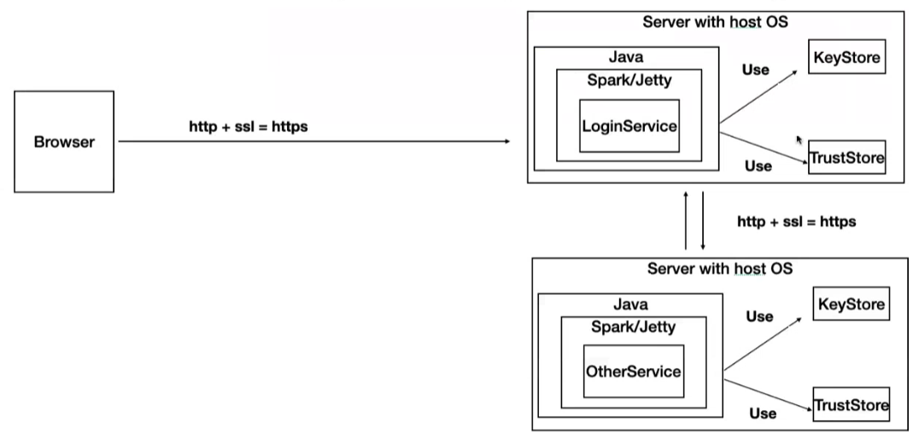

# Aplicación distribuida segura en todos sus frentes
Se realizó una aplicación segura en todos sus frentes, mediante el uso de la herramienta keytool se crearon almacenes de llaves para cada servicio, luego se crearon certificados y finalmente se agregaron esos certificados a almacenes de confianza. 
Todo esto con el fin de garantizar la disponibilidad, la autenticación y la disponibilidad en nuestra aplicación. La aplicación comprende dos servicios: El servicio de login y un servicio que, una vez autenticado un usuario, devuelve la fecha actual. 



## ¿Cómo empezar?
### Requerimientos

- [Java 8](https://www.java.com/es/)
- [Maven](https://maven.apache.org/download.cgi)
- [GIT](https://git-scm.com/downloads)
- [Docker](https://docs.docker.com/desktop/)
- [MongoDB](https://docs.docker.com/desktop/)
  
### Instalación

Para ver el código fuente del proyecto:
```
git clone https://github.com/federico29/AREP-Aplicaci-nSeguraEnTodosSusFrentes.git
```

Consultar las imágenes de Docker utilizadas: [Imágenes](https://hub.docker.com/repository/docker/fede2906b/secure-app).

## Ejecución
Para tener las imágenes en su computador corriendo en contenedores ejecute en una consola de comandos las siguientes líneas:
>```
>docker run -d -p 5000:6000 --name loginservice fede2906b/secure-app:s1
>```
>```
>docker run -d -p 4000:6000 --name dateservice fede2906b/secure-app:s2
>```

Corra la aplicación ingresando al siguiente link: [http://localhost:5000/](http://localhost:5000/)

## Demostración
Puede ver el funcionamiento de la aplicación en el siguiente enlace: [https://youtu.be/Z7hCboGyl5A](https://youtu.be/Z7hCboGyl5A)

## Documentación
Puede generar la documentación del proyecto ejecutando el siguiente comando en el directorio AREP-Aplicaci-nSeguraEnTodosSusFrentes/securespark/ o AREP-Aplicaci-nSeguraEnTodosSusFrentes/dataservice/:
> ```
> mvn javadoc:javadoc
> ```

## Construido con
- Maven
- Java 8
- GIT
- Amazon Web Services
- Docker

## Autor
Federico Barrios Meneses - Estudiante de Ingeniería de Sistemas.

## Licencia
Este proyecto está bajo la Licencia GNU General Public License.
